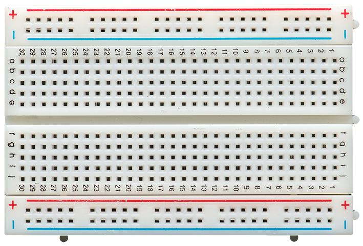
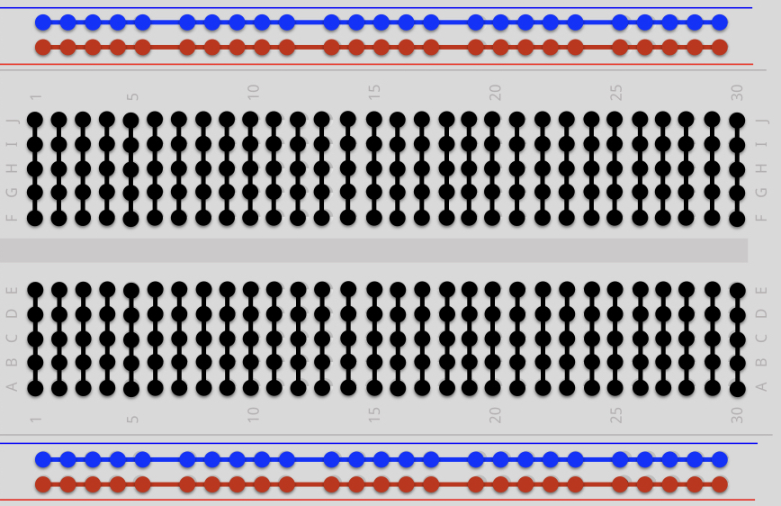
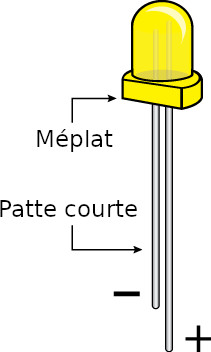

# 🔎 Identification et caractéristiques de chaque composant

## WeMos D1 mini

- ESP8266EX
  - Flash Size 4: MB
  - Fréquence : 80MHz
  - Wi-Fi : IEEE 802.11 b/g/n


## Breadboard
Photos :


Cablâge :


Explications : [magpi.raspberrypi.com](https://magpi.raspberrypi.com/articles/breadboard-tutorial), [learn.adafruit.com](https://learn.adafruit.com/breadboards-for-beginners)

## LED



Explications : [circuits-diy](https://www.circuits-diy.com/how-to-blink-led-using-an-arduino/)

## LDR

## Résistance

Mnémonic pour se rappeler des couleurs :
```
Ne Mangez Rien Ou Jeunez, Voila Bien Votre Grande Bêtise
⚫   🟤     🔴  🟠   🟡    🟣    🔵    🟢   🔘     ⚪
1    2       3   4    5      6      7     8     9      0
```

Voir [ce site pour le calcul des valeurs de résistances](https://www.electronique-radioamateur.fr/elec/composants/resistance-code-couleurs.php).

----
Sources : [microcontrollerslab](https://microcontrollerslab.com), [element14](https://element14.com), [raspberrypi](https://magpi.raspberrypi.com), [circuits-diy](https://www.circuits-diy.com)

----
[⬅️  Accueil](README.md) :: [Pré-requis ➡️](pre-requis.md)
