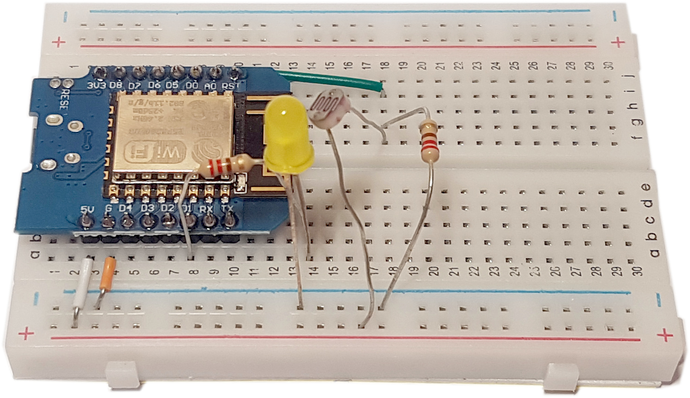

# Accueil

Découvrir la programmation sur ESP en créant un objet connecté.

## ✅ Liste de matériel

- [ ] 1 x ESP8266
- [ ] 1 x Plaque d'essai ou breadboard
- [ ] 1 x Led
- [ ] 1 x LDR 5528 (1 MΩ dans le noir)
- [ ] 5 x Résistances 220 Ω
- [ ] 1 x Câble USB - Micro USB
- [ ] 1 x Adaptateur USB-A -> USB-C
- [ ] 1 x Feu imprimé en 3D + base

## 📝 Codelab

- [🔎 Identification et caractéristiques de chaque composant](composants.md)
- [Installation des pré-requis](installation.md)
- [TP 1 : Simulation d'un ESP avec une LED](tp1.md)
- [TP 2 : Installation de l'IDE & Blink World](tp2.md)
- [TP 3 : Branchement d'une LED](tp3.md)
- [TP 4 : Communication série](tp4.md)
- [TP 5 : Capteur de lumière](tp5.md)
- [TP 6 : LED + LDR](tp6.md)
- [TP 7 : Pilotage d'un feu 🚦](tp7.md)
- [TP 8 : Wifi](tp8.md)
- [TP 9 : Endpoint](tp9.md)

## 📚 Documentation

- [Arduino esp8266](https://arduino-esp8266.readthedocs.io/en/latest/index.html){:target="_blank"}
- [Wifi sur esp8266](https://siytek.com/wemos-d1-mini-arduino-wifi/){:target="_blank"}
