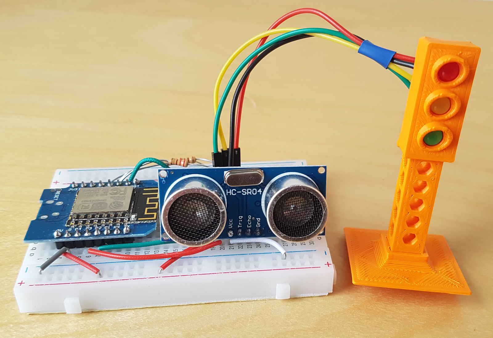

# Accueil

Découvrir la programmation sur ESP en créant un objet connecté.

## ✅ Liste de matériel

- [ ] 1 x ESP8266
- [ ] 1 x Plaque d'essai ou breadboard
- [ ] 1 x Led
- [ ] 1 x LDR 5528 (1 MΩ dans le noir)
- [ ] 4 x Résistances 220 Ω
- [ ] 1 x Résistance 3.3 kΩ
- [ ] 1 x Câble USB - Micro USB
- [ ] 1 x Adaptateur USB-A -> USB-C
- [ ] 1 x Feu imprimé en 3D + base
- [ ] 1 x Capteur de distance HC-SR04

## 📚 Documentation

- [🔎 Identification et caractéristiques de chaque composant](composants.md)
- [🩺 Troubleshooting](troubleshooting.md)
- [Arduino esp8266](https://arduino-esp8266.readthedocs.io/en/latest/index.html){:target="_blank"}
- [Wifi sur esp8266](https://siytek.com/wemos-d1-mini-arduino-wifi/){:target="_blank"}

## 📝 Codelab

- [TP 1 🚀 : Installation de l'IDE & Blink World](tp1.md)
- [TP 2 💡 : Branchement d'une LED](tp2.md)
- [TP 3 ⚙️ : Communication série](tp3.md)
- [TP 4 🔅 : Capteur de lumière](tp4.md)
- [TP 5 🌓 : LED + LDR](tp5.md)
- [TP 6 🚦 : Pilotage d'un feu](tp6.md)
- [TP 7 🦇 : Capteur de distance](tp7.md)
- [TP 8 📡 : Wifi](tp8.md)
- [TP 9 📟 : Endpoint HTTP(s)](tp9.md)
