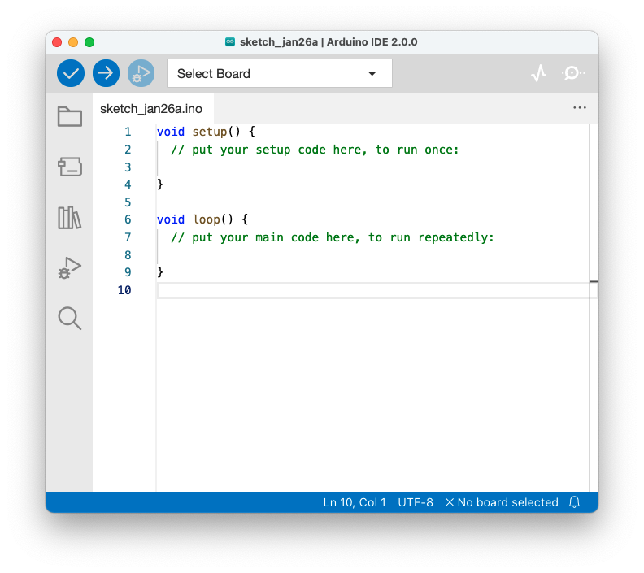

# Installations de l'IDE

1. Installer Arduino IDE : [https://www.arduino.cc/en/software](https://www.arduino.cc/en/software){:target="_blank"}

{: .caution }
⚠️ Il faut être administrateur de son poste et connaitre les éventuelles restrictions du proxy / VPN de votre entreprise.

----
[TP 1 ➡️ ](tp1.md)
