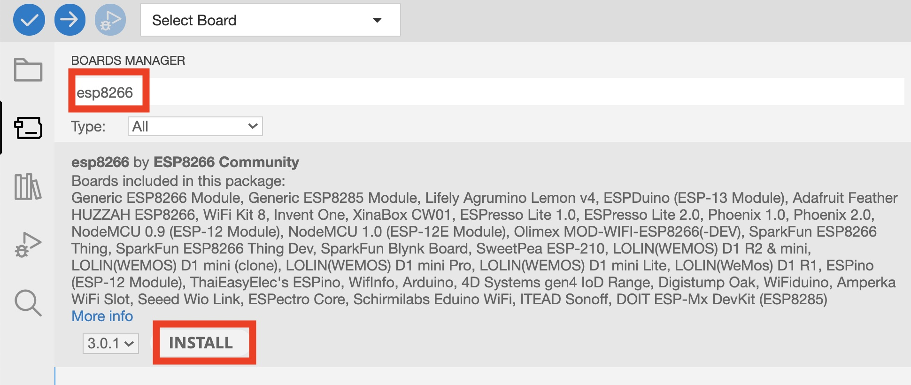

# Installations de l'IDE

{: .tip }
ℹ️ Pendant les phases de téléchargement, vous pouvez [réaliser le TP 1](tp1.md)

1. Installer Arduino IDE : [https://www.arduino.cc/en/software](https://www.arduino.cc/en/software){:target="_blank"}
2. Ajouter les cartes ESP8266 à l'IDE. La [documentation officielle du projet est très riche](https://arduino-esp8266.readthedocs.io/en/latest/){:target="_blank"}.
3. Démarrer _Arduino IDE_ et aller dans _Preferences_;
4. Dans le champs _Additionnals Boards Managers URLs_ mettre `https://arduino.esp8266.com/stable/package_esp8266com_index.json`. S'il y a déjà une URL, utiliser la virgule en tant que séparateur;
  
5. Aller dans _Tools_ > _Board: .*_ > _Boards Manager..._
  
6. Dans le champs de recherche en haut de la fenêtre, saisir `esp8266`, sélectionner le premier résultat puis cliquer sur le bouton _install_ (ℹ️ continuer sur [le TP 1](tp1.md) en attendant)
  
7. Terminer en cliquant sur le bouton _close_

----
[TP 1 ➡️ ](tp1.md)
