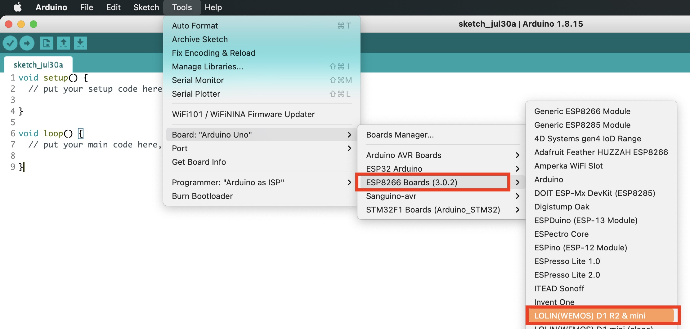
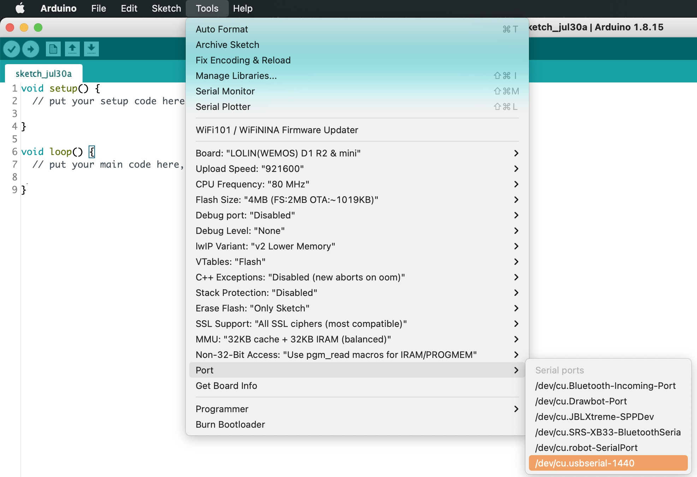
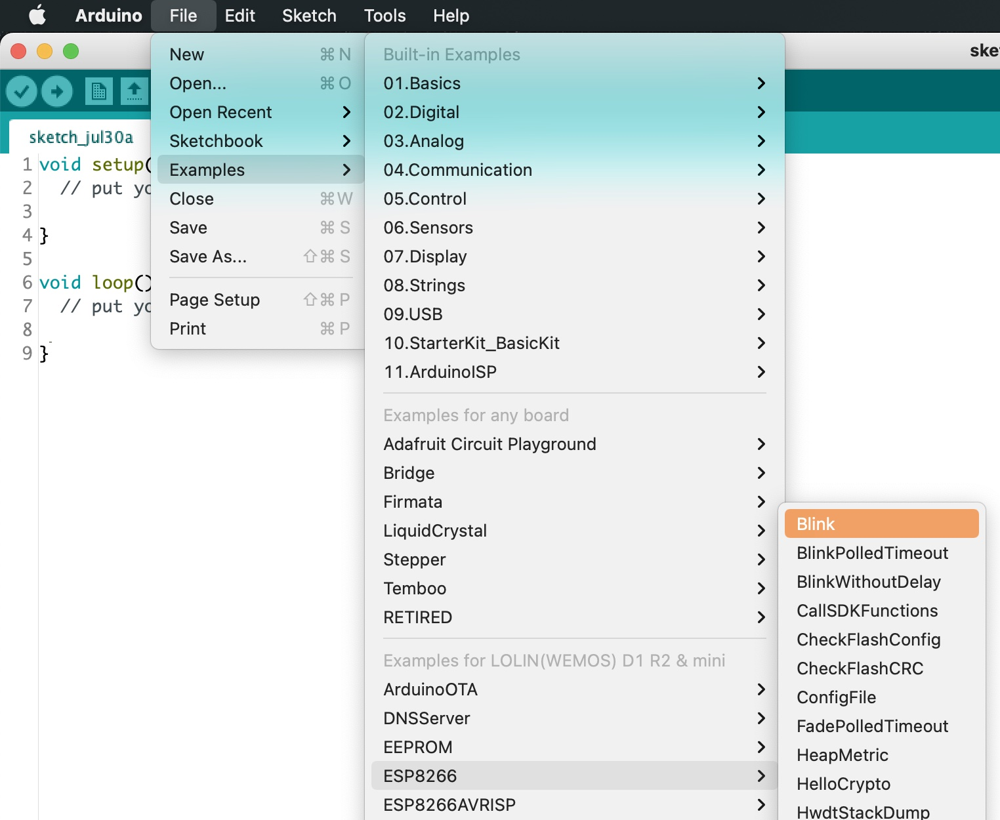
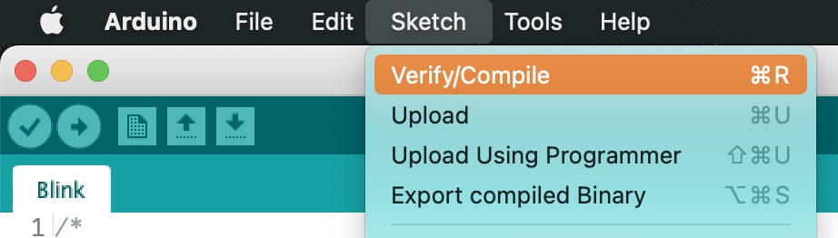
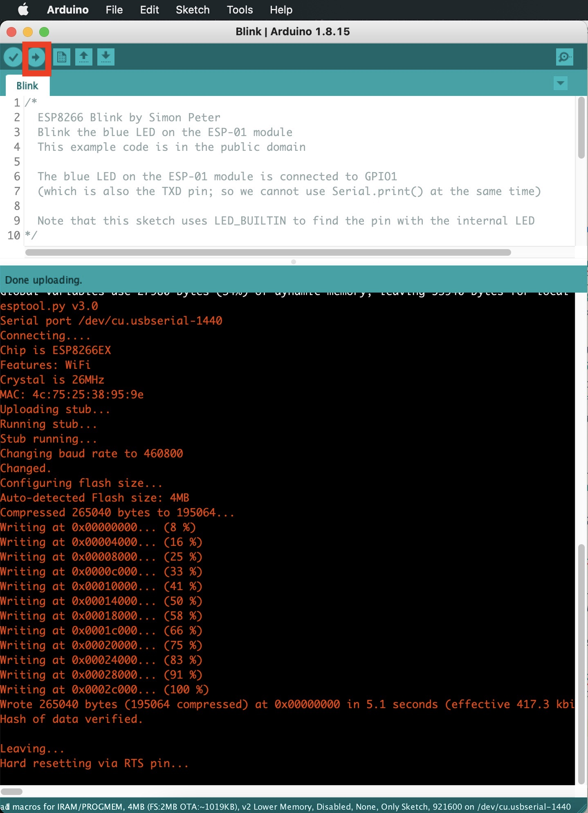

# TP 2 : Utilisation de l'IDE & Blink World

{: .objectiv }
Configuration de l'environnement Arduino IDE et écrire un _sketch_ pour faire clignoter la led interne.

1. Dans Arduino IDE, aller dans le menu _Tools_ > _Board: .*_ >, sélectionner _ESP8266 Boards_ > _LOLIN(WEMOS) D1 R2 & mini_
 
2. Connecter l'ESP avec le câble USB
3. Sélectionner le port de communication via le menu _Tools_ > _Port_ > `/dev/cu.usbserial-*` sous GNU Linux ou macOS, `COM` sous windows
 
4. Créer un premier sketch faisant clignoter la led intégrée en utilisant un snippet de code existant : aller dans _File_ > _Examples_ > _ESP8266_ > _Blink_. Le _sketch_ est le même que dans le TP précédent.

5. Lancer la compilation via le menu _Sketch_ > _Compile_ (ou le bouton "Check")
6. Uploader le programme via le menu _Sketch_ > _Upload_ (ou le bouton "Flèche" surligné en rouge) 
7. Admirer la led clignoter 🎉 

----
[⬅️ TP 1](tp-simulation.md) :: [TP 3 ➡️](tp-led-ext.md)
