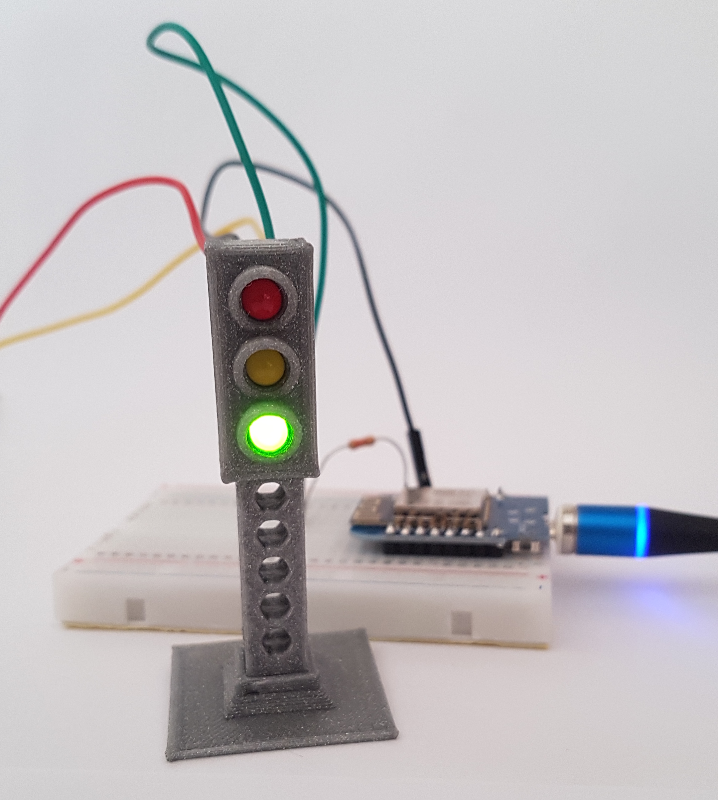
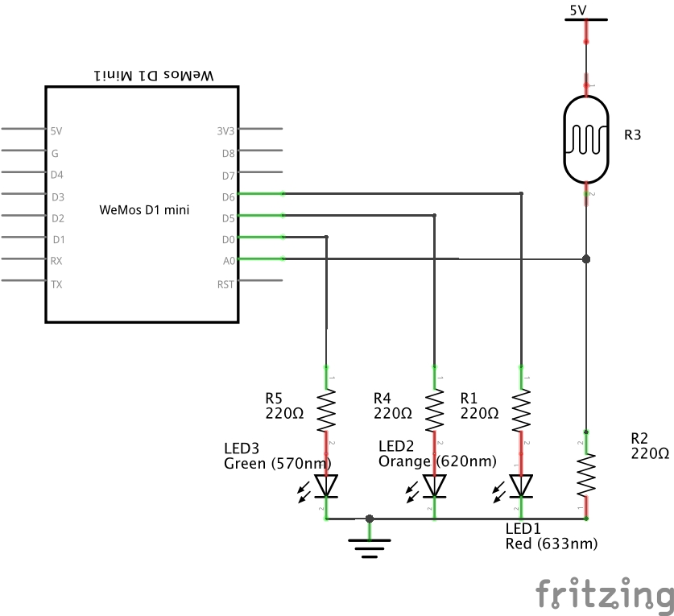
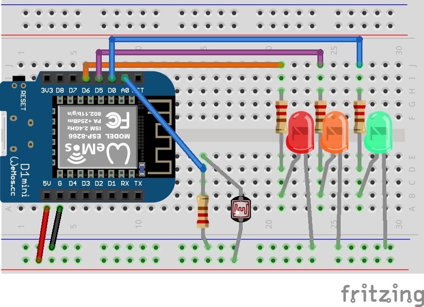

# TP 7 : Faire clignoter un feu tricolore 🚦

{: .objectiv }
Faire clignoter le feu tricolore

Ce feu est imprimé en 3D en PLA, voici les fichiers [des modèles du feu](tp-feu-3d-feu.stl) et [de la base](tp-feu-3d-base.stl).

1. Nous allons le faire clignoter. Ecrire un sketch qui implémente le cycle de changement d'état des leds suivant :
 - Rouge : 5  secondes
 - Vert : 7 secondes
 - Orange : 2 secondes

2. Comme les boutons pour déclencher une traversée d'un piéton ou les capteurs magnétiques sous la chaussée, nous allons maintenant utiliser le capteur de lumière du TP précédent pour accélérer le passage au rouge du feu. Lors de l'activation du capteur, le feu devra passer au orange au maximum dans les 2 secondes puis continuer son cycle normal.

{: .tip }
N'hésitez pas à séparer le contrôle de chaque led dans des méthodes

{:style="counter-reset:none"}
3. Le schéma électronique reprend celui du TP précédent avec 2 LEDs en plus :

4. Voici le câblage correspondant :

{: .caution }
⚠️ Avant toutes manipulations de composants, il faut **débrancher** le câble USB.

----
[{{ site.code-spoiler }}](tp_feu_code.md)
