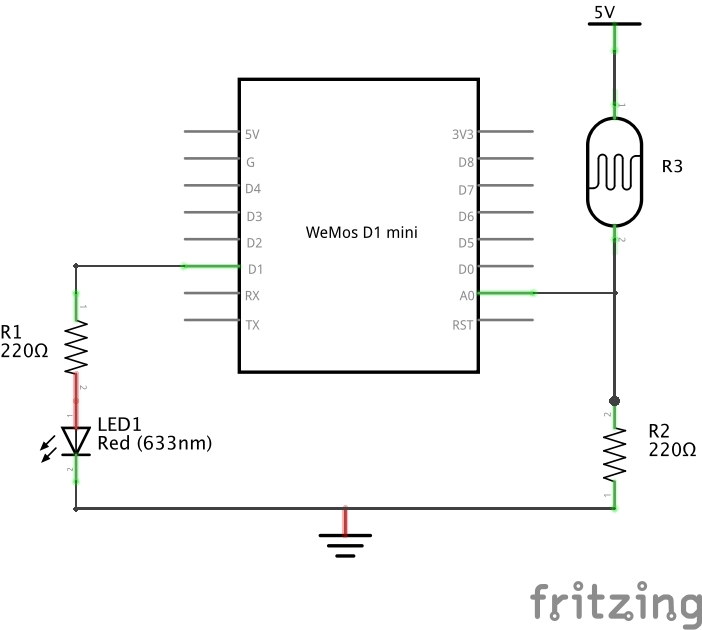
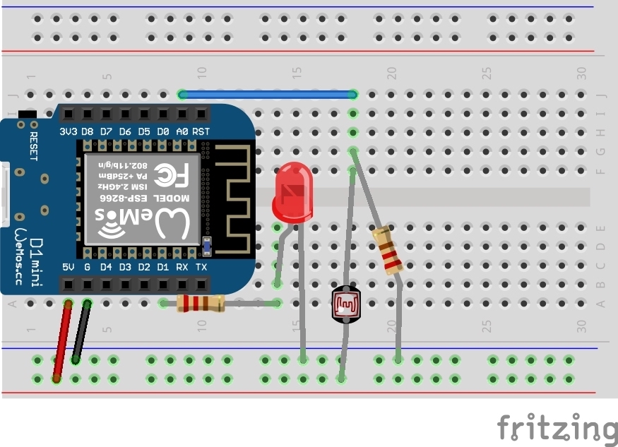

# TP 5 : Allumer la LED en fonction de la luminosité

{: .objectiv }
Allumer la LED si une ombre est détectée.

1. Le schéma électronique est un mélange des 2 TPs précédents :
  - la LED + résistance sur le port `D1`
  - pont de résistances sur `A0`

2. Voici le câblage correspondant :

{: .caution }
⚠️ Avant toutes manipulations de composants, il faut **débrancher** le câble USB.

{:style="counter-reset:none"}
3. Coté code, les instructions de contrôle d'exécution habituelles sont disponibles : `if`, `then`, `else`...

----
[{{ site.code-spoiler }}](tp-led-ldr_code.md)

----
[⬅️ TP 4](tp-ldr.md) :: [TP 6 ➡️](tp-feu.md)
