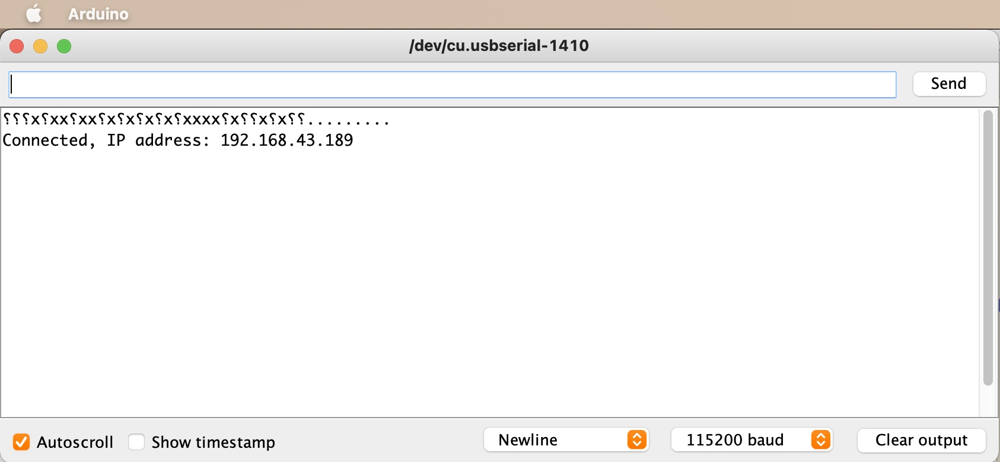

# Réponse : Connecter l'ESP au Wifi

```c
#include <ESP8266WiFi.h>

void setup()
{
  Serial.begin(115200);
  Serial.println();

  WiFi.begin("network-name", "pass-to-network");

  Serial.print("Connecting");
  while (WiFi.status() != WL_CONNECTED)
  {
    delay(500);
    Serial.print(".");
  }
  Serial.println();

  Serial.print("Connected, IP address: ");
  Serial.println(WiFi.localIP());
}

void loop() {}
```

Exemple de sortie console :


