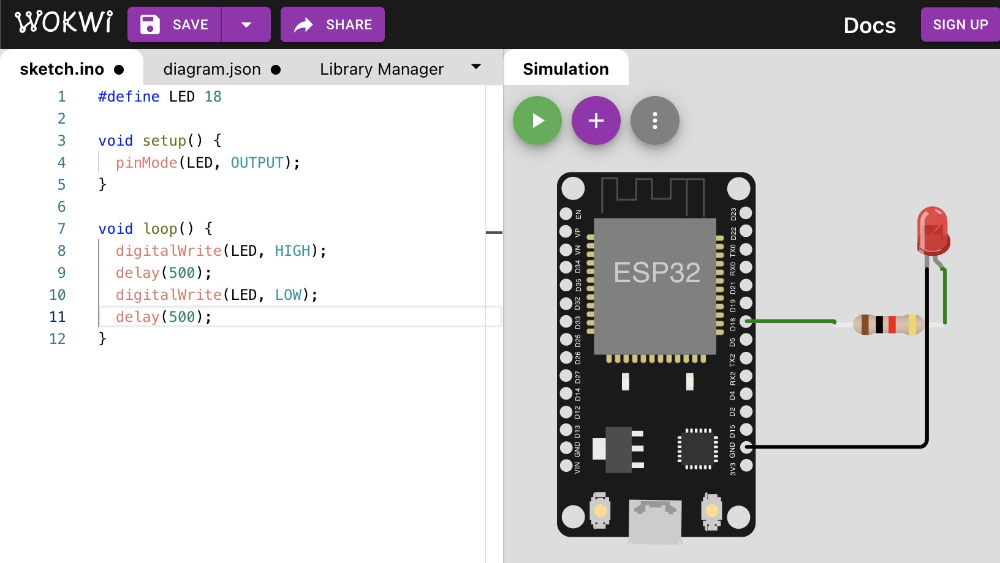

# TP 1 : Simulation d'un ESP avec une LED

{: .objectiv }
Découvrir le language de programmation utilisé sur les Arduinos

Pour se familiariser avec le code "à la Arduino", nous allons débuter avec un outil en ligne permettant de simuler un _Sketch_ (= programme Arduino) sur un ESP avec une LED et une résistance afin de faire clignoter une LED ➡️ [suivre ce tutorial](https://create.arduino.cc/projecthub/Hack-star-Arduino/how-to-simulate-esp32-projects-online-for-free-ad21d9)



Voici [une documentation détaillée](https://docs.arduino.cc/learn/programming/sketches) sur la structure de ce sketch. Les fonctions [`pinMode()`](https://www.arduino.cc/reference/en/language/functions/digital-io/pinmode/) et [`digitalWrite()`](https://www.arduino.cc/reference/en/language/functions/digital-io/digitalwrite/) sont utilisées respectivement pour configurer le sens entrée/sortie de la broche et pour mettre `0` (état bas ou `LOW`) ou `5 V` (état  haut ou `HIGH`) sur cette broche.

Voici le code utilisé dans le TP commenté afin de mieux comprendre :
```c
#define LED 18 // définition d'une constante nommée LED valant 18, un rechercher/remplacer sera effectué par le pre-processeur au moment de la compilation.

// méthode exécutée au démarrage du micro-controleur
void setup() {
  pinMode(LED, OUTPUT);    // configuration de la patte 18 en sortie pour lui affecter OV ou 5V
}

// programme principal : une boucle infinie. le µC n'exécutera que cette fonction jusqu'au son débranchement électrique ou reboot
void loop() {
  digitalWrite(LED, HIGH); // mise en tension de la sortie 18 à 5V
  delay(500);              // attente de 500 ms
  digitalWrite(LED, LOW);  // 0V sur la sortie
  delay(500);              // attente de 500 ms
}
```

----
[⬅️ Pré-requis](pre-requis.md) :: [TP 2 ➡️](tp2.md)
