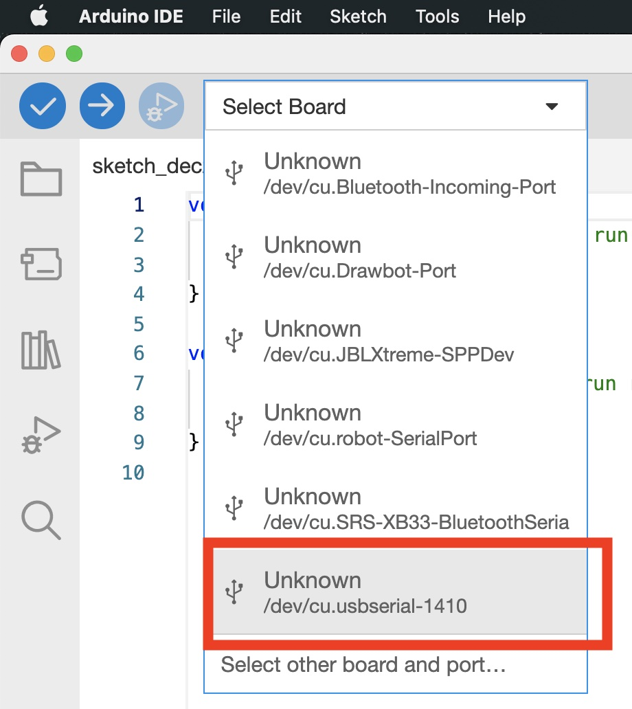
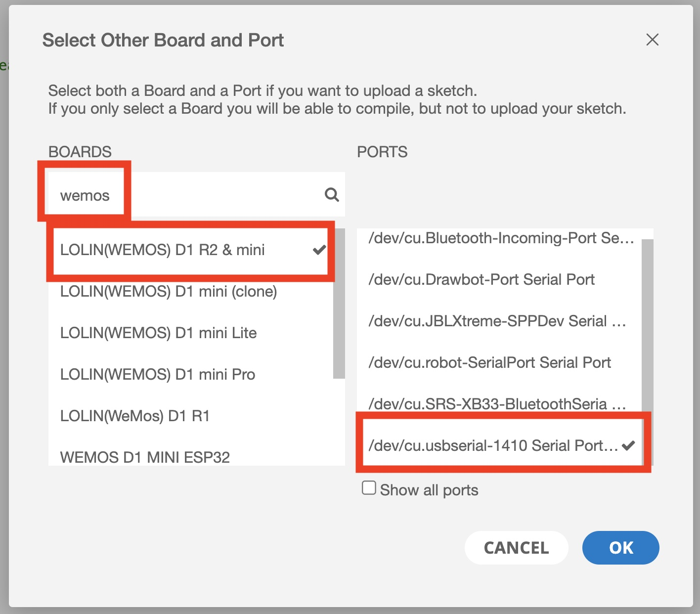
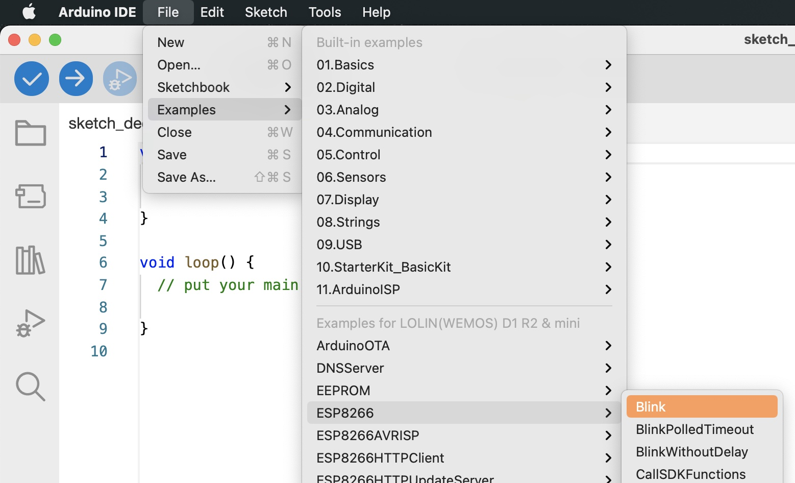
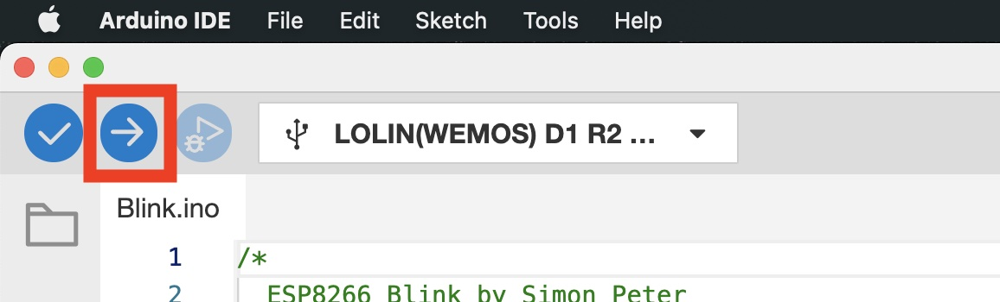
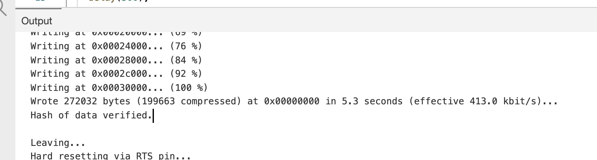
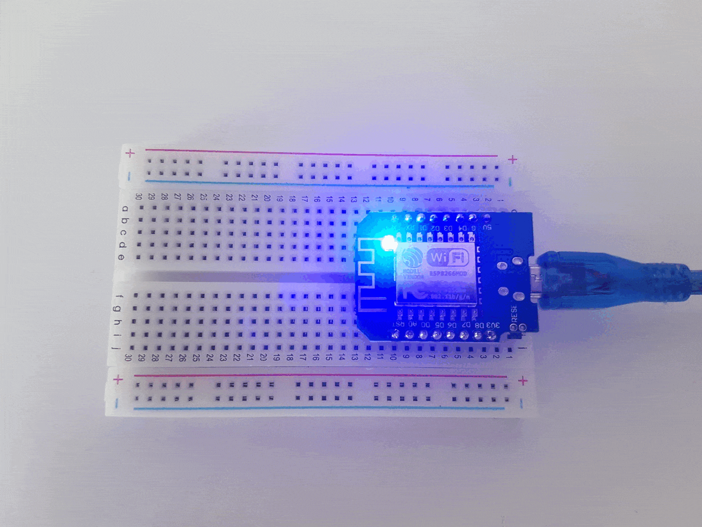

# TP 2 : Utilisation de l'IDE & Blink World

{: .objectiv }
Installation de l'environnement Arduino IDE et écrire un _sketch_ pour faire clignoter la led interne.

1. Installer Arduino IDE : [https://www.arduino.cc/en/software](https://www.arduino.cc/en/software){:target="_blank"}

{: .caution }
⚠️ Il faut être administrateur de son poste et connaitre les éventuelles restrictions du proxy / VPN de votre entreprise.

{:style="counter-reset:none"}
2. Ajouter les cartes ESP8266 à l'IDE : démarrer _Arduino IDE_ et aller dans _Preferences_;
3. Dans le champs _Additionnals Boards Managers URLs_ mettre `https://arduino.esp8266.com/stable/package_esp8266com_index.json`. S'il y a déjà une URL, utiliser la virgule en tant que séparateur;
  
4. Aller dans _Tools_ > _Board: .*_ > _Boards Manager..._
  
5. Dans le champs de recherche en haut de la fenêtre, saisir `esp8266`, sélectionner le premier résultat puis cliquer sur le bouton _install_, il faut une version supérieure ou égale à `1.0.1`.
  

{: .caution }
⚠️ Nous déclinons toute responsabilité en cas de mauvais branchement ou mauvaise manipulation.

{:style="counter-reset:none"}

7. Assurez vous qu'aucun fil n'est branché sur la breadboard, uniquement le micro-contrôleur. Brancher le câble USB sur la carte électronique à l'un des ports USB de votre machine. Utilisez si nécessaire l'adaptateur USB-C.
8. Dans Arduino IDE, ouvrir le menu déroulant "Select Board", sélectionner le port de communication associé à votre carte : `/dev/cu.usbserial-*` sous GNU Linux ou macOS, `COM` sous windows. Il est probable qu'il faille essayer tous les ports pour trouver la carte...
 

{: .tip }
Si la carte n'apparait pas, consulter [la page d'aide des problèmes fréquents](troubleshooting.md)

{:style="counter-reset:none"}

9. Dans la fenêtre qui s'est ouverte, saisir `wemos` dans le champs de recherche puis sélectionner _LOLIN(WEMOS) D1 R2 & mini_ puis valider
 
10. Créer un premier sketch faisant clignoter la led intégrée en utilisant un snippet de code existant : aller dans _File_ > _Examples_ > _ESP8266_ > _Blink_. Le _sketch_ est le même que dans le TP précédent.

11. Lancer la compilation et l'upload du _sketch_ via le bouton "Flèche" surligné en rouge. Le log s'affiche en base de l'écran. 
12. Lorsque le flashage est terminé, la log est de la forme suivante : 

{: .tip }
En cas d'erreur d'upload, consulter [la page d'aide des problèmes fréquents](troubleshooting.md#erreur-dupload)

{:style="counter-reset:none"}
7. Admirer la led clignoter 🎉 

----
[⬅️ TP 1](tp1.md) :: [TP 3 ➡️](tp3.md)
