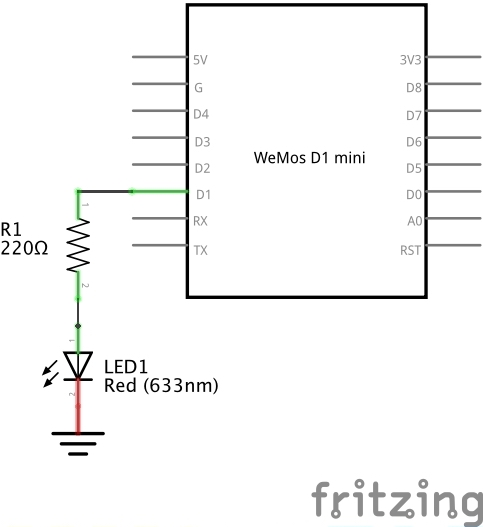
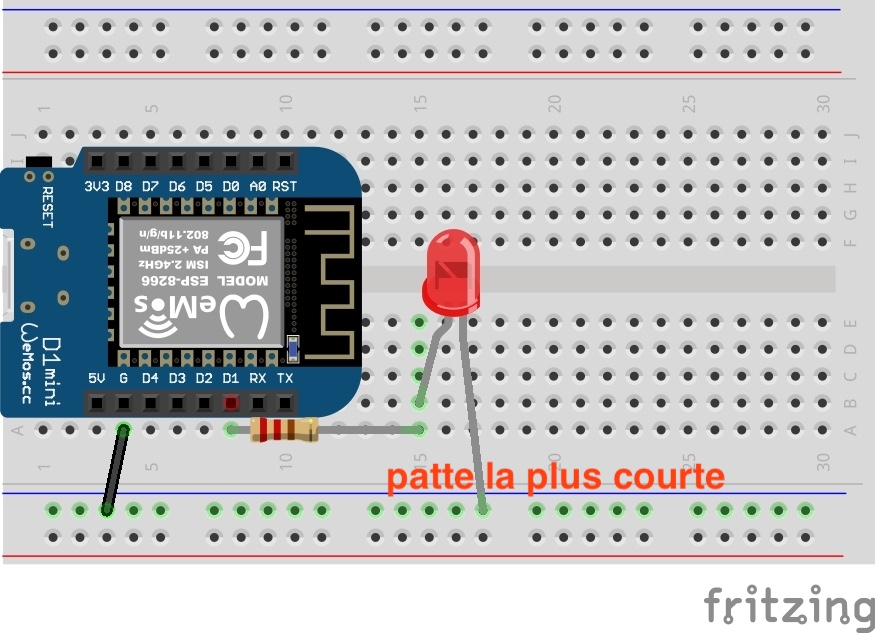

# TP 3 : LED externe

{: .objectiv }
Brancher une LED et la faire clignoter

1. Une LED se branche toujours avec une résistance en série pour la "protéger", c'est à dire réduire la tension à ses bornes. Une led n'accepte pas une tension supérieure à 2.5V voir moins en fonction des modèles. La valeur de la résistance à utiliser pour réduire la tension se calcule avec la loi d'Ohm nottaement : `U = R * I`. Nous utilisons une valeur de 220 Ω (ohms). Les bagues de couleurs sur la résistance permettent de connaitre sa valeur, [voir le code des couleurs](composants.md#résistance). Celle ci est branchée sur la broche `D1`.

2. Le schema électronique pour brancher la led est le suivant :

3. Voici le câblage correspondant :

{: .caution }
⚠️ Avant toutes manipulations de composants, il faut **débrancher** le câble USB.

{:style="counter-reset:none"}
4. Reprendre le sketch du TP2 pour utiliser la sortie `D1` au lieu de `LED_BUILTIN`.

{: .tip }
Si la LED ne clignote pas, commencer par tester en l'inversant, elle ne grillera pas ;-) (tout de suite)

----
[{{ site.code-spoiler }}](tp3_code.md)

----
[⬅️ TP 2](tp2.md) :: [TP 4 ➡️](tp4.md)
