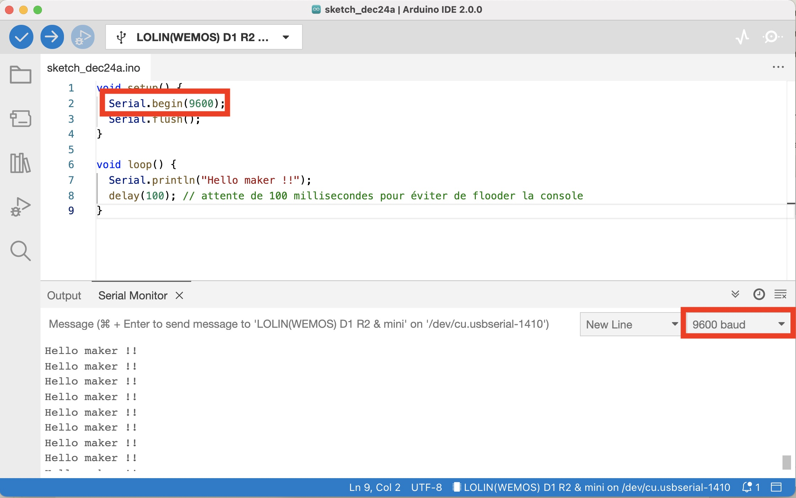

# TP 3 : Communication série

{: .objectiv }
Afficher un message de debug sur la console série

1. La [transmission série](https://fr.wikipedia.org/wiki/Transmission_s%C3%A9rie){:target="_blank"} permet de transmettre des informations entre l'ESP et le PC

2. Pour la communication série, il faut utiliser [`Serial`](https://www.arduino.cc/reference/en/language/functions/communication/serial/){:target="_blank"} :
  - `Serial.begin()` permettant de configurer la vitesse de communication dans la fonction `setup()`
  - `Serial.print()` et `Serial.println()` pour afficher des infos depuis l'emplacement voulu dans le code. <br> Exemple :

```c
void setup() {
  Serial.begin(9600);
  Serial.flush();
}

void loop() {
  Serial.println("Hello maker !!");
  delay(100); // attente de 100 millisecondes pour éviter de flooder la console
}
```

{:style="counter-reset:none"}

3. Uploader votre sketch dans l'ESP avec le bouton *Upload* de l'interface arduino (introduit au TP2)

4. Coté IDE Arduino, utiliser le moniteur série en cliquant sur le bouton suivant :


5. Dans la console qui vient de s'ouvrir, sélectionner la vitesse dans le menu déroulant en bas à droite de la fenêtre en adéquation avec la vitesse définie dans le sketch via l'instruction `Serial.begin(9600);` où `9600` est la vitesse en _baud_ par seconde.


----
[⬅️ TP 2](tp2.md) :: [TP 4 ➡️](tp4.md)
