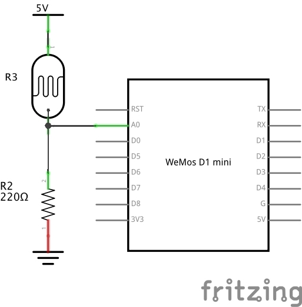
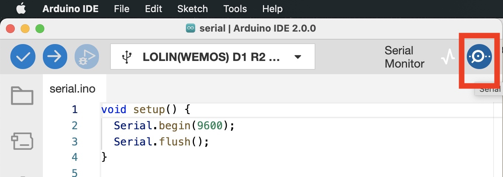
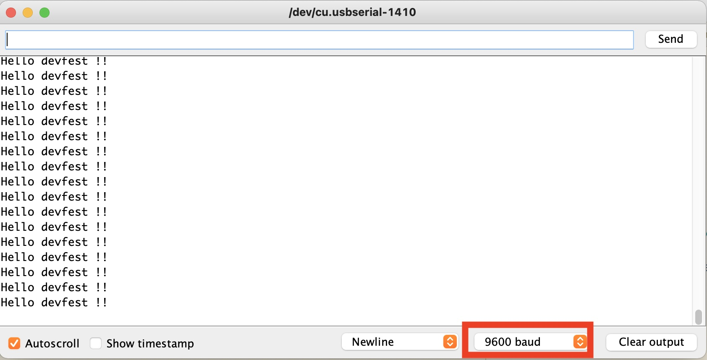

# TP 4 : Capteur de lumière

{: .objectiv }
Brancher le capteur de lumière et afficher sa valeur sur la console série.

1. La résistance de la [LDR](https://en.wikipedia.org/wiki/Photoresistor){:target="_blank"} varie en fonction de la lumière : plus il fait sombre, plus sa résistance est élevée (> 1MΩ), moins il y a de courant qui passe, plus la tension aux bornes du composant est élevée. <br> Nous utiliserons un pont diviseur de tension afin de lire la tension aux bornes de la résistance via la broche `A0` de l'ESP et envoyer la valeur lue sur la console série.

2. Le schéma électronique est le suivant :


3. Voici le câblage correspondant :

{: .caution }
⚠️ Avant toutes manipulations de composants, il faut **débrancher** le câble USB.


{:style="counter-reset:none"}
4. L'API à utiliser pour mesurer la tension aux bornes de la photo-résistance est [`analogRead()`](https://www.arduino.cc/reference/en/language/functions/analog-io/analogread/){:target="_blank"}.

5. Pour la communication série, il faut utiliser [`Serial`](https://www.arduino.cc/reference/en/language/functions/communication/serial/){:target="_blank"} :
  - `Serial.begin()` permettant de configurer la vitesse de communication dans la fonction `setup()`
  - `Serial.print()` et `Serial.println()` pour afficher des infos depuis l'emplacement voulu dans le code. <br> Exemple :

```c
void setup() {
  Serial.begin(9600);
  Serial.flush();
}

void loop() {
  Serial.println("Hello world !!");
  delay(100); // attente de 100 millisecondes pour éviter de flooder la console
}
```

6. Coté IDE Arduino, utiliser le moniteur série en cliquant sur le bouton suivant :


7. Dans la console qui vient de s'ouvrir, sélectionner la vitesse dans le menu déroulant en bas à droite de la fenêtre en adéquation avec la vitesse définie dans le sketch via l'instruction `Serial.begin(9600);` où `9600` est la vitesse en _baud_ par seconde.


----
[{{ site.code-spoiler }}](tp4_code.md)

----
[⬅️ TP 3](tp3.md) :: [TP 5 ➡️](tp5.md)
