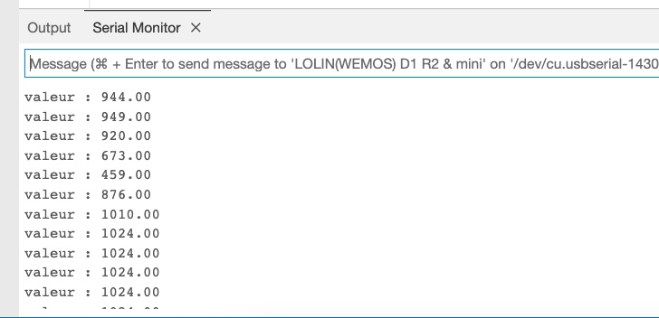

# Réponse : Capteur de lumière

```c
void setup() {
  Serial.begin(9600);
  Serial.flush();
  pinMode(A0, INPUT);
}

void loop() {
  double ldr = analogRead(A0);
  Serial.print("valeur : ");
  Serial.println(ldr);
  delay(100);
}
```

{: .tip }
La valeur lue varie entre `0` et `1024`.



----
[⬅️ Retour à l'énoncé](tp4.md)
