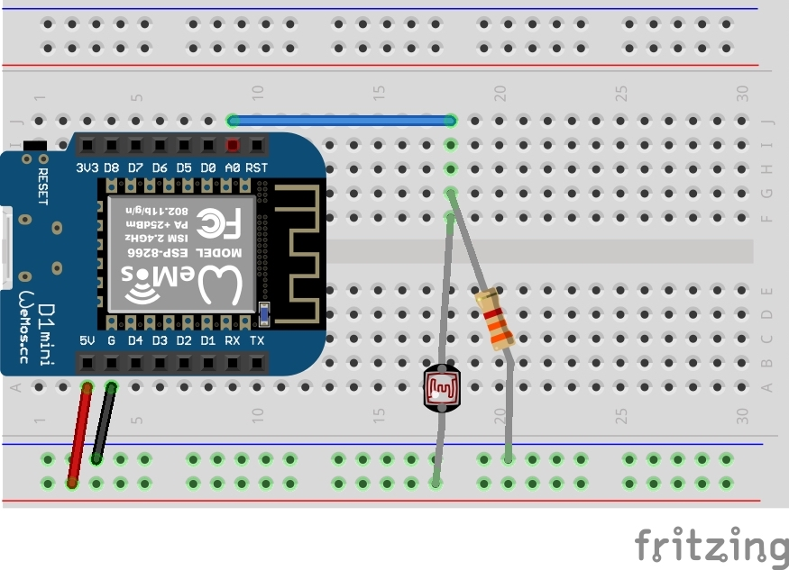

# TP 4 : Capteur de lumière

{: .objectiv }
Brancher le capteur de lumière et afficher sa valeur sur la console série.

La résistance de la [LDR](composants.md#ldr) varie en fonction de la lumière : plus il fait sombre, plus sa résistance est élevée (> 1 MΩ), moins il y a de courant qui passe, plus la tension aux bornes du composant est élevée.

1.  Nous construisons un pont diviseur de tension avec les résistances `R2` de 3.3 kΩ et la LDR afin de lire la tension à ses bornes via la broche `A0` de l'ESP. La valeur lue est affichée sur la console série. Le schéma électronique est le suivant :

3. Voici le câblage correspondant :

{: .caution }
⚠️ Avant toutes manipulations de composants, il faut **débrancher** le câble USB.

{:style="counter-reset:none"}
4. L'API à utiliser pour mesurer la tension aux bornes de la photo-résistance est [`analogRead()`](https://www.arduino.cc/reference/en/language/functions/analog-io/analogread/){:target="_blank"}.

5. Une fois le code écrit et uploadé, n'oubliez pas d'afficher la console série pour voir les valeurs lues.

----
[{{ site.code-spoiler }}](tp5_code.md)

----
[⬅️ TP 3](tp4.md) :: [TP 5 ➡️](tp6.md)
