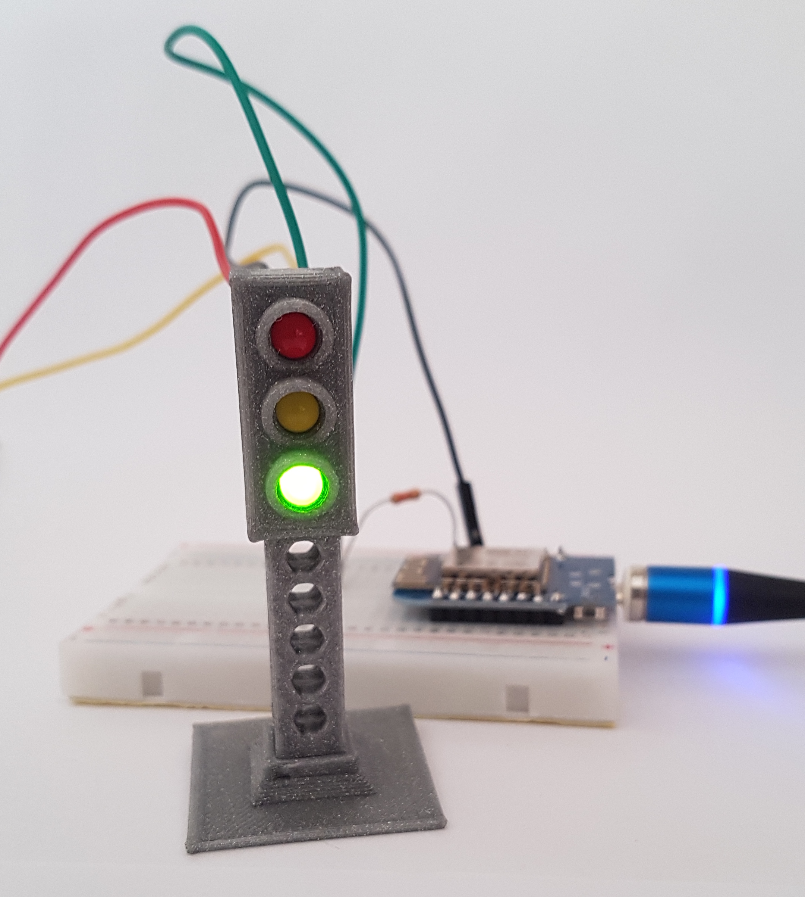
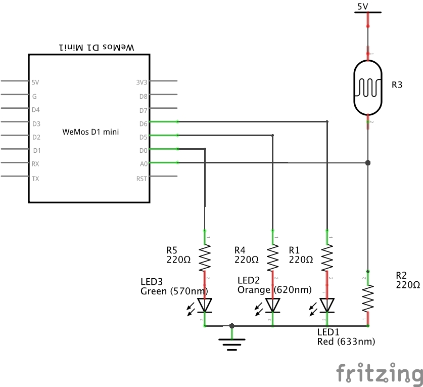
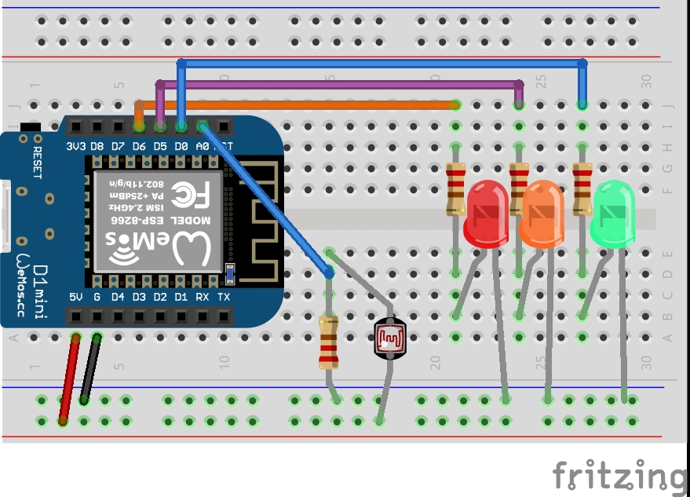

# TP 5 bis : Faire clignoter un feu tricolore 🚦

{: .objectiv }
Faire clignoter le feu tricolore

{: .warning }
⚠️ Avant toutes manipulations de composants, il faut **débrancher** le câble USB.

1. Nous allons maintenant faire clignoter le feu tricolore imprimé en 3D fourni.
Le cycle souhaité est :
 - Rouge : 5  secondes
 - Vert : 7 secondes
 - Orange : 2 secondes

2. Comme les boutons pour déclencher une traversée d'un piéton ou les capteurs magnétiques sous la chaussée, nous allons maintenant utiliser le capteur de lumière du TP précédent pour accélérer le passage au rouge du feu. Lors de l'activation du capteur, le feu devra passer au orange au maximum dans les 2 secondes puis continuer son cycle normal.

{: .tip }
N'hésitez pas à séparer le contrôle de chaque led dans des méthodes

3. Le schéma électronique reprend celui du TP précédent avec 2 LEDs en plus :

4. Voici le câblage correspondant :

----
[{{ site.code-spoiler }}](tp5_feu_code.md)
