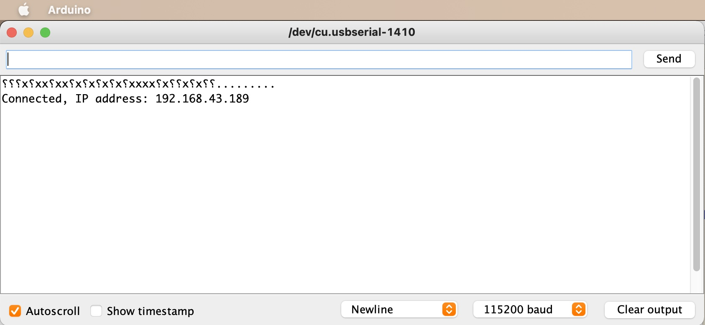

# TP 6 : Connecter l'ESP au Wifi

{: .objectiv }
Configurer le Wifi sur l'ESP puis afficher son adresse IP.

L'API pour configurer le WIFI est riche, le [quick start de la documentation](https://arduino-esp8266.readthedocs.io/en/latest/esp8266wifi/readme.html) fournit un exemple de sketch à mettre en oeuvre. Le Wifi à utiliser est soit celui de la cité des congrès soit votre 4G.

{: .tip }
Il n'est pas nécessaire de modifier le câblage des composants.

Ne pas oublier de configurer la vitesse de communication de la console série en adéquation avec l'instruction `Serial.begin(115200);`.

TODO mettre en spoiler le code
```c
#include <ESP8266WiFi.h>

void setup()
{
  Serial.begin(115200);
  Serial.println();

  WiFi.begin("network-name", "pass-to-network");

  Serial.print("Connecting");
  while (WiFi.status() != WL_CONNECTED)
  {
    delay(500);
    Serial.print(".");
  }
  Serial.println();

  Serial.print("Connected, IP address: ");
  Serial.println(WiFi.localIP());
}

void loop() {}
```

Exemple de sortie console :



----
[⬅️ TP 5](tp5.md) :: [TP 7 ➡️](tp7.md)
