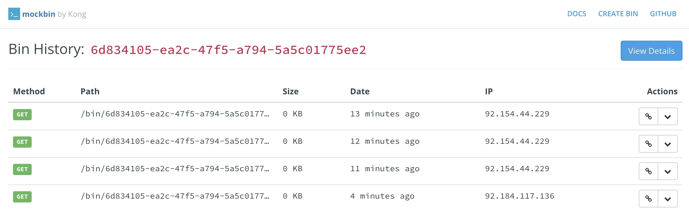

# TP 7 : Faire un appel HTTP

{: .objectiv }
Appeler un endpoint en HTTP sur [Mockbin.org](https://mockbin.org/){:target="_blank"}  depuis l'ESP

[Mockbin.org](https://mockbin.org/){:target="_blank"}  est un service de test de endpoint sur lequel il est possible de créer des urls customs, des paramètres attendus ainsi qu'une réponse personnalisée... Le site fournit également une page [d'historique des appels via l'interface pour retrouver son appel]({{ site.endpoint.http }}/log){:target="_blank"} .

## Appel en HTTP
Parcourir les exemples disponibles dans l'IDE sous _File_ > _Examples_ > _ESP8266HTTPClient_ pour implémenter un sketch appelant l'url [{{ site.endpoint }}]({{ site.endpoint }}){:target="_blank"} en GET.

[{{ site.code-spoiler }}](tp7_code.md#appel-en-http)

## Appel en HTTPs

Pour aller plus loin, réaliser un sketch effectuant un appel en HTTPs sur le même endpoint.

[{{ site.code-spoiler }}](tp7_code.md#appel-en-https)
