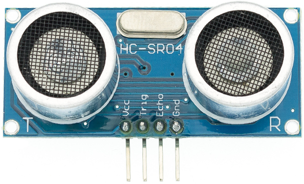

# TP 8 : Intégrer un capteur de distance 🦇

{: .objectiv }
Ecrire un sketch affichant en console toute les secondes la distance mesurée par le capteur avec un objet.

Le capteur de distance que nous utilisons est un modèle [HC-SR04](composants.md##capteur-de-distance). Ce type de capteur est utilisé dans les pare-chocs des voitures pour détecter la présence d'obstacles lors des manoeuvres.

Pour intégrer ce capteur dans notre projet, il faut rechercher de la documentation et des exemples de montages avec votre moteur de recherche préféré. Il y a beaucoup de documentation disponible pour les Arduinos, moins sur les ESP8266.

Les Arduinos sont une autre famille de micro-controlleur très utilisée dans le monde du DIY. Le code que nous écrivons pour notre ESP8266 est presque compatible avec les Arduinos, la différence réside dans le nom des PIN utilisés. Par conséquent, si vous ne trouvez pas de documentation directement pour ESP8266, il faut commencer par chercher des example pour Arduinos puis les transposer.
La disposition des PIN de l'ESP est disponible sur [la page des composants](composants.md#micro-contrôleur).

{: .caution }
⚠️ Avant toutes manipulations de composants, il faut **débrancher** le câble USB.

1. Le capteur peut être directement enfiché verticalement sur la breadboard en branchant les PIN suivantes :
- `VCC` : à l'alimentation, soit 5V
- 'GND' : à la masse
- `echo` : rélié à la pin `D1` de l'ESP
- `trigger` : rélié à la pin `D2` de l'ESP

[{{ site.code-spoiler }}](tp8_code.md#mesure-de-distance)

{:style="counter-reset:none"}
2. Une fois la distance affichée, modifier le sketch afin d'allumer les différentes LED du feu en fonction de la distance en reprenant le câblage du TP précédent en implémentant les règles suivantes :
- Vert 🟢 : >= 12 cm
- Orange 🟠 : < 12 cm et > 7 cm
- Rouge 🔴 : =< 7 cm

[{{ site.code-spoiler }}](tp8_code.md#feu)

----
[⬅️ TP 7](tp7.md) :: [TP 9 ➡️](tp9.md)
