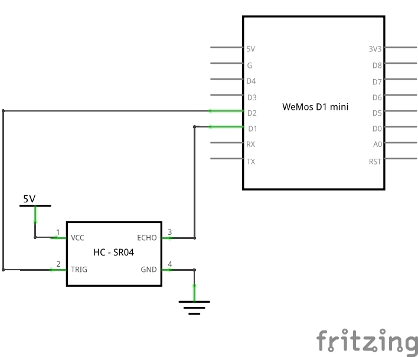
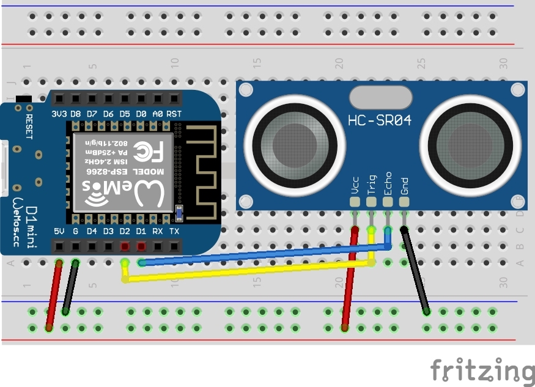
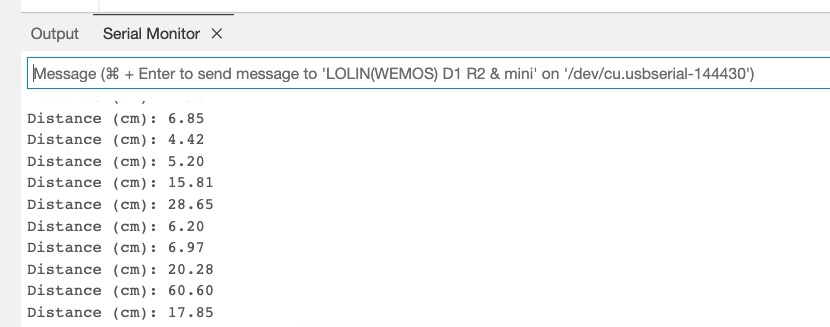
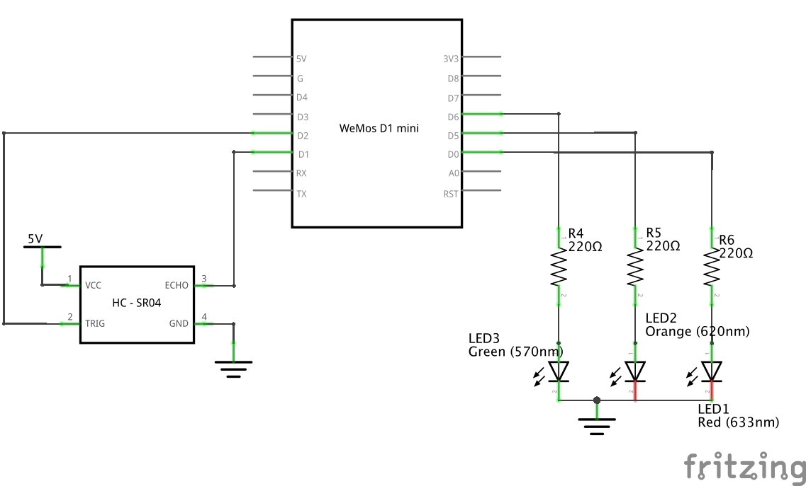
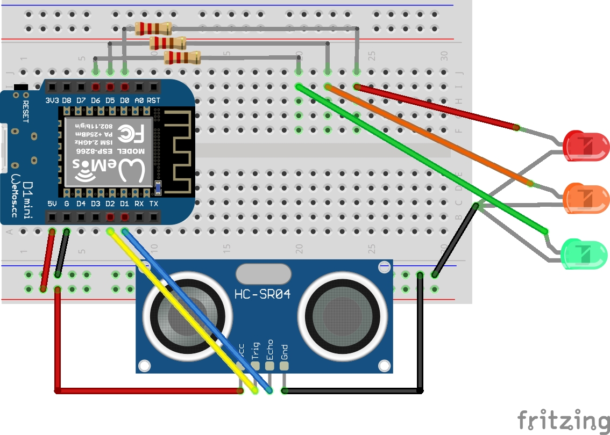

# Réponse : Capteur de distance

## Mesure de distance

1. La documentation utilisée est celle ci : [https://randomnerdtutorials.com/esp8266-nodemcu-hc-sr04-ultrasonic-arduino/](https://randomnerdtutorials.com/esp8266-nodemcu-hc-sr04-ultrasonic-arduino/){:target="_blank"}

2. Le schéma est le suivant :



{:style="counter-reset:none"}
3. Le montage correspondant est :



{:style="counter-reset:none"}
4. Voici le code du sketch :

```c
/*********
  Rui Santos
  Complete project details at https://RandomNerdTutorials.com/esp8266-nodemcu-hc-sr04-ultrasonic-arduino/

  Permission is hereby granted, free of charge, to any person obtaining a copy
  of this software and associated documentation files.

  The above copyright notice and this permission notice shall be included in all
  copies or substantial portions of the Software.
*********/

#define TRIGGER_PIN D1
#define ECHO_PIN D2

//define sound velocity in cm/uS
#define SOUND_VELOCITY 0.034

long duration;
float distanceCm;

void setup() {
  Serial.begin(115200); // Starts the serial communication
  pinMode(TRIGGER_PIN, OUTPUT); // Sets the TRIGGER_PIN as an Output
  pinMode(ECHO_PIN, INPUT); // Sets the ECHO_PIN as an Input
}

void loop() {
  // Clears the TRIGGER_PIN
  digitalWrite(TRIGGER_PIN, LOW);
  delayMicroseconds(2);
  // Sets the TRIGGER_PIN on HIGH state for 10 micro seconds
  digitalWrite(TRIGGER_PIN, HIGH);
  delayMicroseconds(10);
  digitalWrite(TRIGGER_PIN, LOW);

  // Reads the ECHO_PIN, returns the sound wave travel time in microseconds
  duration = pulseIn(ECHO_PIN, HIGH);

  // Calculate the distance
  distanceCm = duration * SOUND_VELOCITY/2;

  // Prints the distance on the Serial Monitor
  Serial.print("Distance (cm): ");
  Serial.println(distanceCm);

  delay(1000);
}
```

{: .warning }
Ne pas oublier de changer la vitesse de communication en `baud` de la console série.

La sortie de console est alors :



## Indicateur de distance

1. Le schéma est le suivant :



{:style="counter-reset:none"}
2. Le montage correspondant est :



{:style="counter-reset:none"}
3. Voici le code du sketch :

```c
```

----
[⬅️ Retour à l'énoncé](tp8.md)
