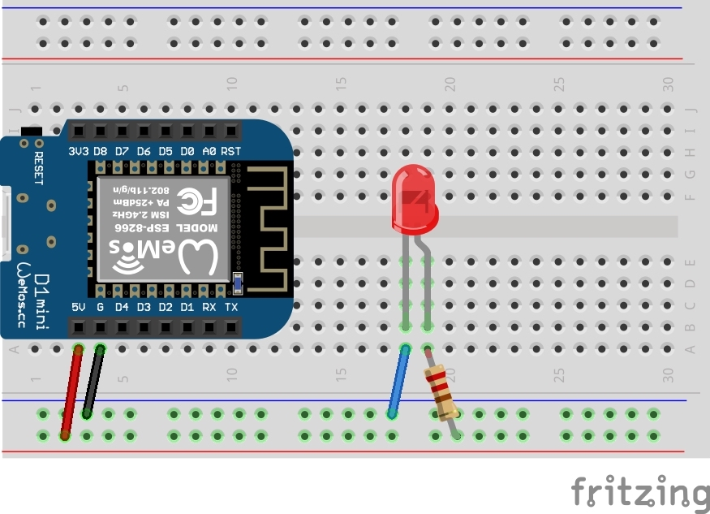

# 🩺 Troubleshooting

## Vérification du fonctionnement de la LED

Le montage suivant permet d'allumer de manière continue la LED sans écrire un sketch

## Erreur d'upload

En cas d'erreur d'upload, il faut re-essayer.

Vérifier également que le cable USB de l'ESP8266 est bien connecté à l'ordinateur ! ;)

Si le problème persiste, appuyer sur le bouton `RESET` situé en haut à droite du port USB.

## Pas d'affichage sur le moniteur série

Bien vérifier que les valeurs `Serial.begin(9600)` et la valeur choisie dans la liste déroulante en bas à droite de celui-ci correspondent
